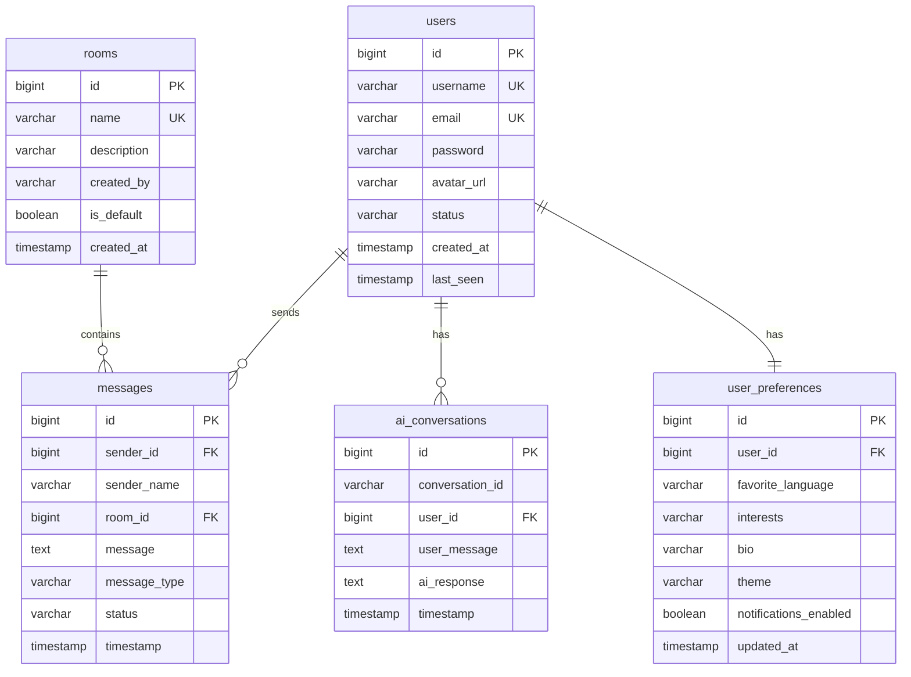

# VSK Connect AI

### AI-Powered Real-Time Communication Platform

A modern, full-stack real-time chat platform featuring intelligent AI memory, room-based communication, persistent chat history, and cloud-native deployment. Built with Spring Boot 4, React 19, Socket.IO, Spring AI with Groq, and Neon PostgreSQL.

---

## ✨ Features

### 💬 Real-Time Chat
- **Room-based messaging** with Socket.IO — messages appear instantly, no refresh needed
- **Typing indicators** — see when others are composing messages
- **Online presence** — live user status with avatars
- **Persistent history** — every message stored in Neon PostgreSQL
- **Message search** — find messages across rooms

### 🤖 AI Assistant with Memory
- **Personal AI conversations** powered by Groq (Llama 3.3 70B)
- **Conversation memory** — AI remembers your previous interactions
- **Context-aware responses** — loads user preferences + recent history before responding
- **Streaming responses** — see AI replies appear in real-time, ChatGPT-style
- **Privacy-first** — AI only accesses personal conversations, never room chats

### 🔐 Authentication & Security
- JWT-based authentication with BCrypt password hashing
- Stateless session management
- CORS protection, input validation, secure environment variables

### 🎨 Premium UI
- **Glassmorphism** design with neon accents
- **Dark theme** inspired by Discord, Slack, and Linear
- **Framer Motion** animations throughout
- **Responsive** — works on desktop, tablet, and mobile
- **DiceBear avatars** — auto-generated from usernames

---

## 🏗️ Architecture

```
┌─────────────────┐     ┌──────────────────┐     ┌─────────────────┐
│                 │     │                  │     │                 │
│  React 19       │────▶│  Spring Boot 3   │────▶│  Neon           │
│  (Vercel)       │REST │  (Render)        │ JPA │  PostgreSQL     │
│                 │     │                  │     │                 │
│  Vite           │     │  Spring AI       │────▶│  Groq API       │
│  Tailwind v4    │     │  Socket.IO       │     │  (Llama 3.3)    │
│  Framer Motion  │     │  JWT Security    │     │                 │
│                 │     │                  │     │                 │
└────────┬────────┘     └──────────────────┘     └─────────────────┘
         │                       ▲
         │    Socket.IO          │
         └───────────────────────┘
              (Direct WebSocket)
```

### Key Design Decisions
- **Socket.IO via netty-socketio** runs on a separate port (9092) from Spring Boot (8080)
- **Vercel cannot proxy WebSockets** — the frontend connects directly to the Render backend for Socket.IO
- **REST API calls** proxy through Vercel rewrites to the Render backend
- **AI is optional** — the chat application works fully even if Groq is unavailable

---

## 📁 Folder Structure

```
vsk-connect-ai/
├── backend/
│   ├── Dockerfile
│   ├── render.yaml
│   ├── pom.xml
│   └── src/main/java/com/vskconnect/
│       ├── VskConnectApplication.java
│       ├── config/          # CORS, Socket.IO, DataSeeder
│       ├── entity/          # User, Room, Message, AIConversation, UserPreference
│       ├── repository/      # Spring Data JPA repositories
│       ├── dto/             # Request/Response DTOs
│       ├── security/        # JWT, Auth filter, Security config
│       ├── service/         # Business logic
│       ├── controller/      # REST API endpoints
│       ├── socket/          # Socket.IO event handlers
│       ├── ai/              # Spring AI + Groq integration
│       ├── memory/          # AI memory system
│       └── util/            # Avatar utilities
│
├── frontend/
│   ├── vercel.json
│   ├── package.json
│   ├── vite.config.js
│   └── src/
│       ├── index.css         # Design system
│       ├── App.jsx           # Routing
│       ├── api/              # Axios HTTP layer
│       ├── contexts/         # Auth, Socket, Chat contexts
│       ├── hooks/            # Custom React hooks
│       ├── pages/            # Login, Register, Chat
│       ├── components/       # All UI components
│       └── utils/            # Constants, helpers
│
└── README.md
```

---

## 🗄️ Database Design

### Tables

| Table | Purpose |
|-------|---------|
| `users` | User accounts (username, email, hashed password, avatar, status) |
| `rooms` | Chat rooms (name, description, default flag) |
| `messages` | All chat messages (sender, room, content, timestamp, type) |
| `ai_conversations` | Personal AI conversation history (user, message, response) |
| `user_preferences` | User settings (favorite language, interests, bio, theme) |

### Entity Relationships



---

## 🧠 AI Memory System

### How It Works

1. **User sends message** to AI assistant
2. **Load user preferences** (favorite language, interests, bio)
3. **Retrieve recent memory** — last N personal AI conversations from PostgreSQL
4. **Build context prompt** — combine preferences + memory + current message
5. **Call Groq API** via Spring AI (OpenAI-compatible endpoint)
6. **Save conversation** — store both user message and AI response
7. **Return response** — with streaming support for progressive display

### Memory Architecture

```
┌──────────────────┐
│  User sends      │
│  "What's my      │
│   fav language?" │
└────────┬─────────┘
         │
         ▼
┌──────────────────┐     ┌──────────────────┐
│  MemoryService   │────▶│  PostgreSQL      │
│  getRecentMemory │     │  ai_conversations│
│  (last 50 chats) │     └──────────────────┘
└────────┬─────────┘
         │
         ▼
┌──────────────────┐     ┌──────────────────┐
│ MemoryContext    │────▶│  UserPreference  │
│ Builder          │     │  (fav language,  │
│ (format prompt)  │     │   interests)     │
└────────┬─────────┘     └──────────────────┘
         │
         ▼
┌──────────────────┐     ┌──────────────────┐
│  PromptBuilder   │────▶│  Groq API        │
│  (system + user) │     │  Llama 3.3 70B   │
└──────────────────┘     └──────────────────┘
```

### Privacy Rules
- AI **ONLY** reads personal `ai_conversations` table
- AI **NEVER** reads room messages, group chats, or other users' data
- Each user's memory is completely isolated

### Future-Ready Design
The memory architecture is designed so future upgrades can support:
- Vector embeddings for semantic search
- RAG (Retrieval-Augmented Generation)
- LLM-based conversation summarization
- Currently uses simple PostgreSQL queries (no external vector DB needed)

---

## 🔌 API Endpoints

### Authentication

| Method | Endpoint | Description | Auth |
|--------|----------|-------------|------|
| POST | `/api/auth/register` | Register new user | ❌ |
| POST | `/api/auth/login` | Login, returns JWT | ❌ |
| POST | `/api/auth/logout` | Logout user | ✅ |
| GET | `/api/auth/me` | Get current user | ✅ |

### Rooms

| Method | Endpoint | Description | Auth |
|--------|----------|-------------|------|
| GET | `/api/rooms` | List all rooms | ✅ |
| POST | `/api/rooms` | Create new room | ✅ |
| GET | `/api/rooms/{id}` | Get room details | ✅ |
| GET | `/api/rooms/search?q=` | Search rooms | ✅ |

### Messages

| Method | Endpoint | Description | Auth |
|--------|----------|-------------|------|
| GET | `/api/messages/{roomId}?page=0&size=50` | Get room messages (paginated) | ✅ |
| GET | `/api/messages/{roomId}/search?q=` | Search messages in room | ✅ |

### AI Assistant

| Method | Endpoint | Description | Auth |
|--------|----------|-------------|------|
| POST | `/api/ai/chat` | Send message to AI | ✅ |
| POST | `/api/ai/chat/stream` | Stream AI response (SSE) | ✅ |
| GET | `/api/ai/history?page=0&size=20` | Get AI conversation history | ✅ |

### User

| Method | Endpoint | Description | Auth |
|--------|----------|-------------|------|
| GET | `/api/users/preferences` | Get user preferences | ✅ |
| PUT | `/api/users/preferences` | Update preferences | ✅ |
| PUT | `/api/users/status` | Update user status | ✅ |

---

## 🔄 Socket.IO Events

### Client → Server

| Event | Payload | Description |
|-------|---------|-------------|
| `join_room` | `{ roomId, userId, username }` | Join a chat room |
| `leave_room` | `{ roomId, userId, username }` | Leave a chat room |
| `send_message` | `{ roomId, senderId, senderName, message }` | Send a message |
| `typing_start` | `{ roomId, username }` | Started typing |
| `typing_stop` | `{ roomId, username }` | Stopped typing |

### Server → Client

| Event | Payload | Description |
|-------|---------|-------------|
| `new_message` | `MessageDto` | New message in room |
| `user_joined` | `{ username, onlineUsers[] }` | User joined room |
| `user_left` | `{ username, onlineUsers[] }` | User left room |
| `user_typing` | `{ username }` | User is typing |
| `user_stop_typing` | `{ username }` | User stopped typing |
| `online_users` | `string[]` | Full online users list |

---

## 🚀 Deployment

### Prerequisites
- Node.js 20+ (frontend)
- Java 21 (backend, handled by Docker)
- Neon PostgreSQL account
- Groq API key
- Vercel account
- Render account

### Environment Variables

#### Backend (Render Dashboard)

| Variable | Example Value |
|----------|---------------|
| `SPRING_DATASOURCE_URL` | `jdbc:postgresql://ep-xxx-pooler.us-east-2.aws.neon.tech:5432/neondb?sslmode=require` |
| `SPRING_DATASOURCE_USERNAME` | `neondb_owner` |
| `SPRING_DATASOURCE_PASSWORD` | `your_password` |
| `GROQ_API_KEY` | `gsk_xxxxx` |
| `JWT_SECRET` | `your-super-secret-key-min-32-chars` |
| `FRONTEND_URL` | `https://your-app.vercel.app` |
| `SPRING_PROFILES_ACTIVE` | `prod` |

#### Frontend (Vercel Dashboard)

| Variable | Example Value |
|----------|---------------|
| `VITE_API_URL` | `https://your-app.onrender.com` |
| `VITE_SOCKET_URL` | `https://your-app.onrender.com` |

---

### Neon PostgreSQL Setup

1. Create account at [neon.tech](https://neon.tech)
2. Create a new project
3. Copy the **pooled** connection string (contains `-pooler` in hostname)
4. Set `sslmode=require` in the JDBC URL
5. Tables are auto-created by Hibernate on first run (`ddl-auto=update`)

### Render Setup

1. Fork/push this repo to GitHub
2. Create a new **Web Service** on [render.com](https://render.com)
3. Connect your GitHub repo, select `backend/` as root directory
4. Render auto-detects the Dockerfile
5. Add all environment variables from the table above
6. Deploy — the service will build and start automatically

### Vercel Setup

1. Connect your GitHub repo to [vercel.com](https://vercel.com)
2. Set root directory to `frontend/`
3. Framework preset: **Vite**
4. Build command: `npm run build`
5. Output directory: `dist`
6. Add environment variables: `VITE_API_URL` and `VITE_SOCKET_URL`
7. Update `vercel.json` with your Render backend URL
8. Deploy

---

## 🛠️ Local Development

### Backend

```bash
cd backend

# Set environment variables (or create .env file)
export SPRING_DATASOURCE_URL=jdbc:postgresql://localhost:5432/vskconnect
export GROQ_API_KEY=your_groq_key
export JWT_SECRET=dev-secret-key

# Run with Maven wrapper
./mvnw spring-boot:run
```

Backend starts on `http://localhost:8080`
Socket.IO starts on `http://localhost:9092`

### Frontend

```bash
cd frontend

# Install dependencies
npm install

# Start dev server
npm run dev
```

Frontend starts on `http://localhost:5173`

---

## 🔮 Future Enhancements

- **Vector embeddings** — Semantic memory search with pgvector
- **RAG pipeline** — Retrieval-Augmented Generation for smarter AI
- **LLM summarization** — Auto-summarize long conversation histories
- **File uploads** — Share images, documents, and code files
- **Voice messages** — Record and send audio
- **Video calls** — WebRTC integration
- **Message reactions** — Emoji reactions on messages
- **Thread replies** — Nested conversations within rooms
- **Push notifications** — Browser and mobile notifications
- **Admin dashboard** — Room management, user moderation
- **End-to-end encryption** — For private conversations
- **Multi-language support** — i18n for global users

---

## 📜 Tech Stack Summary

| Layer | Technology | Version |
|-------|-----------|---------|
| Frontend | React | 19 |
| Build Tool | Vite | 6+ |
| Styling | Tailwind CSS | 4 |
| Animations | Framer Motion | 11+ |
| HTTP Client | Axios | 1.7+ |
| Real-Time | Socket.IO Client | 4.8+ |
| Icons | Lucide React | 1.21+ |
| Backend | Spring Boot | 4.1.0 |
| Language | Java | 21 LTS |
| AI Framework | Spring AI | 2.0.0 |
| AI Provider | Groq (Llama 3.3 70B) | — |
| WebSocket | netty-socketio | 2.0.14 |
| Database | PostgreSQL (Neon) | 16 |
| Auth | JWT (java-jwt) | 4.4.0 |
| Deployment | Render + Vercel | — |

---

## 👨‍💻 Author

**VSK** — Built as part of TechnoHacks Internship 2026

---

## 📄 License

This project is built for educational and internship evaluation purposes.
